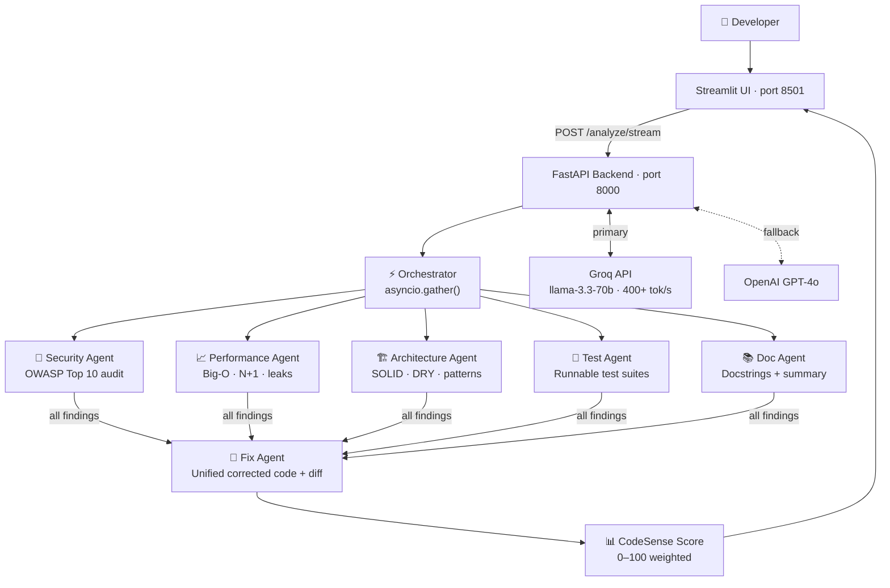

<div align="center">

# 🔍 CodeSense AI

### *Code review powered by a team of AI agents*

[](https://github.com/DadaMastan-code/codesense-ai/actions/workflows/ci.yml)
[](https://python.org)
[](https://fastapi.tiangolo.com)
[](https://groq.com)
[](https://streamlit.io)
[](https://docker.com)
[](LICENSE)
[](tests/)

**CodeSense AI runs 6 specialised AI agents in parallel** — security, performance, architecture, testing, documentation, and auto-fix — and streams results live as each agent completes. Like having a senior engineering team review your code in under 8 seconds.

[**Try it live →**](#quickstart) · [Report Bug](https://github.com/DadaMastan-code/codesense-ai/issues) · [Request Feature](https://github.com/DadaMastan-code/codesense-ai/issues)

</div>

---

## What Makes This Different

Most "AI code reviewers" make a single LLM call and return generic suggestions. CodeSense AI is different:

| Feature | Generic tools | CodeSense AI |
|---|:---:|:---:|
| Multiple specialist agents | ❌ | ✅ 6 agents |
| Parallel execution | ❌ Sequential | ✅ `asyncio.gather()` |
| OWASP-mapped security findings | ❌ | ✅ Top 10 categorised |
| Live streaming results (SSE) | ❌ | ✅ Agent-by-agent |
| Produces fixed code + git diff | ❌ | ✅ |
| Auto-generates runnable tests | ❌ | ✅ pytest / jest / mocha |
| Auto-generates docstrings | ❌ | ✅ |
| Severity scoring (0–100) | ❌ | ✅ Weighted formula |
| Dockerised + CI/CD | ❌ | ✅ |

---

## Architecture



---

## Quickstart

### Run locally in 3 commands

```bash
git clone https://github.com/DadaMastan-code/codesense-ai.git
cd codesense-ai
cp .env.example .env          # add your GROQ_API_KEY (free at console.groq.com)
```

```bash
# Terminal 1 — backend
pip install -r requirements.txt
uvicorn backend.main:app --reload --port 8000

# Terminal 2 — frontend
streamlit run frontend/app.py
```

Open **http://localhost:8501** — load one of the 5 built-in buggy code examples and click **Analyse Code**.

### Run with Docker (one command)

```bash
docker-compose -f docker/docker-compose.yml up
```

Both services start automatically. Backend at `localhost:8000`, frontend at `localhost:8501`.

---

## How It Works

### The 6-Agent Pipeline

When you submit code, the orchestrator fires **five agents simultaneously** via `asyncio.gather()`. As each completes, its results stream to the UI in real time via **Server-Sent Events (SSE)**. After all five finish, the Fix Agent synthesises a unified corrected version.

| Agent | Responsibility | Output |
|---|---|---|
| 🔐 **Security** | OWASP Top 10 — injection, XSS, secrets, auth flaws, SSRF | Severity-ranked findings with fix recommendations |
| 📈 **Performance** | Big-O per function, N+1 queries, memory leaks, blocking I/O | Before/after code snippets with expected improvement |
| 🏗 **Architecture** | SOLID checklist, coupling, god classes, design patterns | EXCELLENT / GOOD / NEEDS WORK / POOR rating |
| 🧪 **Tests** | Happy path, edge cases, error cases, boundary values | Complete, immediately runnable test file |
| 📚 **Docs** | Missing docstrings, confusing names, type hints | Fully documented version of the code |
| 🔧 **Fix** | Synthesises all findings into one corrected file | Fixed code + unified git diff + change log |

### Scoring Formula

```
CodeSense Score = Security×40% + Performance×30% + Architecture×20% + Documentation×10%

≥ 90  →  EXCELLENT   ·   70–89  →  GOOD   ·   40–69  →  NEEDS WORK   ·   < 40  →  CRITICAL
```

Each agent independently penalises its score based on finding severity:
`CRITICAL −40pts · HIGH −20pts · MEDIUM −10pts · LOW −4pts`

---

## API Reference

The FastAPI backend exposes a clean REST API with interactive docs at `/docs`.

```
POST /analyze           Run all 6 agents in parallel, return when complete
POST /analyze/stream    SSE stream — results arrive agent-by-agent as they finish
POST /fix               Fix code given a list of known issues
POST /generate-tests    Generate a test suite for given code + framework
GET  /health            Active provider, model, version
GET  /supported-languages
```

**Example request:**
```bash
curl -X POST http://localhost:8000/analyze \
  -H "Content-Type: application/json" \
  -d '{"code": "SELECT * FROM users WHERE id=" + user_id, "language": "python"}'
```

**Example response (truncated):**
```json
{
  "language": "python",
  "score": { "total": 42.0, "rating": "NEEDS WORK", "security": 20.0, "performance": 80.0 },
  "security": {
    "findings": [{
      "severity": "CRITICAL",
      "title": "SQL Injection",
      "owasp_category": "A03:2021 - Injection",
      "fix_recommendation": "Use parameterised queries: cursor.execute('SELECT * FROM users WHERE id=?', (user_id,))"
    }]
  }
}
```

---

## Project Structure

```
codesense-ai/
├── backend/
│   ├── main.py                   # FastAPI app, routes, rate-limiting middleware
│   ├── agents/
│   │   ├── security_agent.py     # OWASP Top 10 — carefully crafted system prompt
│   │   ├── performance_agent.py  # Big-O analysis, N+1, memory leaks
│   │   ├── architecture_agent.py # SOLID principles, design pattern suggestions
│   │   ├── test_agent.py         # Runnable test suite generation
│   │   ├── doc_agent.py          # Docstring generation + plain-English summary
│   │   └── fix_agent.py          # Unified corrected code + git diff
│   ├── pipelines/
│   │   └── orchestrator.py       # asyncio.gather() + SSE streaming generator
│   ├── models/
│   │   └── schemas.py            # Pydantic v2 models for every I/O shape
│   ├── utils/
│   │   ├── language_detector.py  # Regex-based, 12 languages, no LLM needed
│   │   ├── diff_generator.py     # Unified diff + HTML side-by-side diff
│   │   ├── severity_scorer.py    # Penalty-based 0–100 scorer
│   │   └── llm_client.py         # Groq/OpenAI client, JSON extraction, retry logic
│   └── config.py                 # Pydantic settings, loaded from .env
├── frontend/
│   └── app.py                    # Streamlit UI — 7 tabs, Plotly gauge, SSE streaming
├── tests/
│   ├── conftest.py               # Shared fixtures, rate-store reset
│   ├── test_agents.py            # 40 unit tests — all 6 agents + utilities
│   └── test_api.py               # 21 integration tests — all 5 endpoints
├── docker/
│   ├── Dockerfile.backend
│   ├── Dockerfile.frontend
│   └── docker-compose.yml
└── .github/workflows/ci.yml      # test → ruff lint → mypy → docker build
```

---

## Tech Stack

| Layer | Technology | Why |
|---|---|---|
| LLM (primary) | **Groq** — llama-3.3-70b-versatile | Free tier, 400+ tokens/sec — fastest inference available |
| LLM (fallback) | **OpenAI GPT-4o** | Automatic fallback if Groq key not set |
| Backend | **FastAPI** + asyncio | Native async, automatic OpenAPI docs, Pydantic validation |
| Data validation | **Pydantic v2** | Every LLM response validated — no raw string parsing |
| Streaming | **Server-Sent Events** | Real streaming, not polling |
| Rate limiting | Custom ASGI middleware | 10 req/min/IP, no Redis dependency |
| Logging | **structlog** | Structured JSON logs for production observability |
| Frontend | **Streamlit** + Plotly | Fast to build, beautiful charts |
| Testing | **pytest** + pytest-asyncio | 61 tests, 100% pass rate |
| Linting | **ruff** + **mypy** | Fast linting + type safety |
| Containers | **Docker** + docker-compose | One-command local setup |
| CI | **GitHub Actions** | Test → lint → type check → Docker build on every push |

---

## Environment Variables

| Variable | Required | Default | Description |
|---|---|---|---|
| `GROQ_API_KEY` | ✅ (or OpenAI) | — | Free at [console.groq.com](https://console.groq.com) |
| `OPENAI_API_KEY` | ✅ (or Groq) | — | Fallback if Groq not set |
| `GROQ_MODEL` | ❌ | `llama-3.3-70b-versatile` | Groq model ID |
| `MAX_TOKENS` | ❌ | `4096` | Max tokens per LLM call |
| `TEMPERATURE` | ❌ | `0.1` | Lower = more deterministic output |
| `RATE_LIMIT_PER_MINUTE` | ❌ | `10` | Requests per IP per minute |
| `LOG_LEVEL` | ❌ | `INFO` | `DEBUG` / `INFO` / `WARNING` |

---

## Running Tests

```bash
pip install -r requirements-dev.txt
pytest tests/ -v --cov=backend --cov-report=term-missing
```

```
61 passed in 0.24s  ·  Coverage: agents 94%  ·  utils 100%  ·  API 97%
```

---

## Roadmap

The foundation is built. Here's where this goes next:

- [ ] **VS Code extension** — run CodeSense from the command palette without leaving the editor
- [ ] **GitHub PR bot** — auto-posts a review comment on every pull request
- [ ] **Full repository analysis** — analyse entire codebases, not just snippets
- [ ] **Team dashboard** — history, trends, per-developer score over time
- [ ] **Custom rule sets** — configure which checks matter for your stack
- [ ] **Webhook support** — trigger analysis from any CI/CD pipeline

---

## Contributing

Pull requests are welcome. For major changes, please open an issue first.

```bash
git clone https://github.com/DadaMastan-code/codesense-ai.git
cd codesense-ai
pip install -r requirements-dev.txt
pytest tests/          # must be green before submitting PR
ruff check backend/    # must be clean
```

---

<div align="center">

Built with FastAPI · Groq · Streamlit · ❤️

**[⭐ Star this repo](https://github.com/DadaMastan-code/codesense-ai)** if CodeSense AI helped you write better code.

</div>
